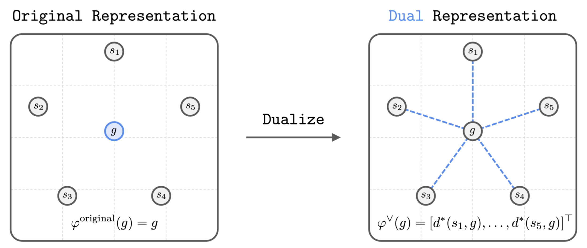

<div align="center">
    <h1> Dual Goal Representations </h1>
    <br><br>
</div>

This repository implements the base algorithms and representation learning methods used in the paper. This includes the following:
* Base offline goal-conditioned RL algorithms:
   * Goal-conditioned implicit value learning (GCIVL)
   * Contrastive reinforcement learning (CRL)
   * Goal-conditioned flow behavioral cloning (GCFBC)
* Representation learning methods:
   * Dual goal representations
   * Bootstrap your own latent gamma (BYOL-gamma)
   * Temporal representation alignment (TRA)
   * Variational information bottleneck (VIB)
   * Value implicit pre-training (VIP)
## Reproducing paper results 
We provide a complete list of **command-line flags**
used to produce the main paper results in [hyperparameters.sh](/hyperparameters.sh). 
Here are some example commands:

```shell
# GCIVL with original representations
python main.py --env_name=scene-play-v0 --agent=agents/gcivl/original.py --agent.alpha=10.0 --agent.discount=0.99
# GCIVL with dual representations
python main.py --env_name=scene-play-v0 --agent=agents/gcivl/state/dual.py --agent.alpha=10.0 --agent.rep_type=bilinear --agent.rep_expectile=0.7 --agent.goalrep_dim=256 --agent.discount=0.99
# GCIVL with BYOL-gamma representations
python main.py --env_name=scene-play-v0 --agent=agents/gcivl/state/byol.py --agent.alpha=10.0 --agent.goalrep_dim=256 --agent.discount=0.99
# GCIVL with TRA representations
python main.py --env_name=scene-play-v0 --agent=agents/gcivl/state/tra.py --agent.alpha=10.0 --agent.goalrep_dim=256 --agent.discount=0.99
# GCIVL with VIB representations
python main.py --env_name=scene-play-v0 --agent=agents/gcivl/state/vib.py --agent.alpha=10.0 --agent.beta=0.001 --agent.goalrep_dim=256 --agent.discount=0.99
# GCIVL with VIP representations
python main.py --env_name=scene-play-v0 --agent=agents/gcivl/state/vip.py --agent.alpha=10.0 --agent.goalrep_dim=256 --agent.discount=0.99
```

Evaluating agents with rliable:
```shell
# Agent 1
uv run eval_trained.py \
    --env_name=puzzle-3x3-play-v0 \
    --agent=agents/crl/dual.py \
    --restore_path=results/.../crl_dual/checkpoints --restore_epoch=31000

# Agent 2
uv run eval_trained.py \
    --env_name=puzzle-3x3-play-v0 \
    --agent=agents/gcfbc/dual.py \
    --restore_path=results/.../gcfbc_dual/checkpoints --restore_epoch=50000
```
Comparing them:
```shell
uv run compare_agents.py \
    --results_dirs eval_results/<crl_dir> eval_results/<gcfbc_dir> \
    --labels "CRL-Dual" "GCFBC-Dual" \
    --output_dir comparison_results/puzzle_3x3
```